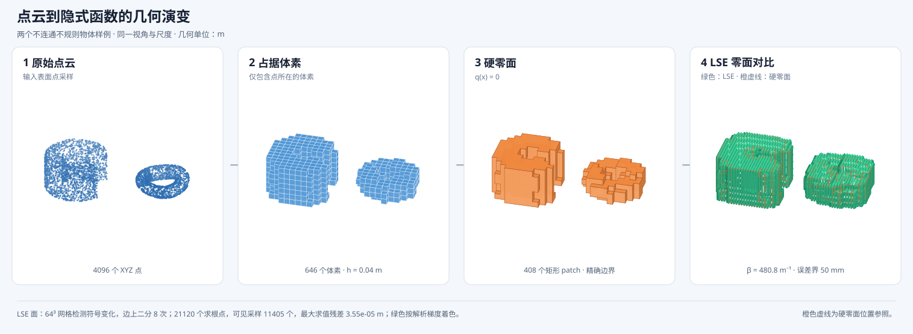

# 两个不连通不规则点云示例

该示例在同一个 XYZ 文件中放入两个彼此断开的表面点云：

1. 左侧为挤出的 C 形环扇，包含内外圆柱曲面、上下平面、两个切平面和明显凹口；
2. 右侧为三瓣波浪环面，包含中心孔、三瓣径向变化和上下起伏。



输入由
[`generate_disconnected_irregular_surface.py`](../scripts/generate_disconnected_irregular_surface.py)
确定性生成：

```bash
python3 scripts/generate_disconnected_irregular_surface.py

build/build_halfspace_tree \
  data/disconnected_irregular_surface.xyz \
  output/disconnected_irregular_visualization_50mm_v2 \
  --pipeline octree \
  --tree-source boundary \
  --boundary-expression direct \
  --boundary-query dag \
  --voxel-size 0.04 \
  --distance-field lse \
  --lse-error 0.05 \
  --execution-sharing structural \
  --lse-kernel binary \
  --validation-cache auto \
  --sign-propagation packed \
  --sdf-max-work 500000000

python3 scripts/visualize_point_cloud_pipeline.py \
  --input data/disconnected_irregular_surface.xyz \
  --artifacts output/disconnected_irregular_visualization_50mm_v2 \
  --output docs/assets/disconnected_irregular_pipeline_demo.svg
```

输入共 4096 点，其中 C 形体 2304 点、波浪环面 1792 点。使用
$h=0.04\,\mathrm m$ 后得到 646 个占据体素。按共享面作 6 邻接检查，两个分量分别有
449 和 197 个体素；将共享边和顶点也计作相连时，分量数量和大小保持不变。

硬函数通过完整符号证书：

$$
q(\mathbf x)<0\ \text{表示自由空间},\qquad
q(\mathbf x)=0\ \text{表示两个体素分量的真实边界}.
$$

在 $0.05\,\mathrm m$ 标量误差预算下，自动得到
$\beta=480.763\,\mathrm m^{-1}$。与图一致的 $64^3$ 采样中，
$\{\mathbf x:d_\beta(\mathbf x)\leq0\}$ 仍为两个 6 邻接分量。对两个物体之间的
$x=0$ 平面作 $161\times161$ 采样，得到

$$
\min d_\beta(0,y,z)=0.0699076\,\mathrm m>0.
$$

因此，这组输入和参数下的硬零面与采样 LSE 零面都保持断开。该 LSE 结论是有限采样
检查；更小的物体间隙或更大的平滑误差预算仍可能使零面合并。

输入参数见
[`disconnected_irregular_surface.json`](../data/disconnected_irregular_surface.json)，构建与验证
指标见 [`benchmark.json`](../output/disconnected_irregular_visualization_50mm_v2/benchmark.json)。
