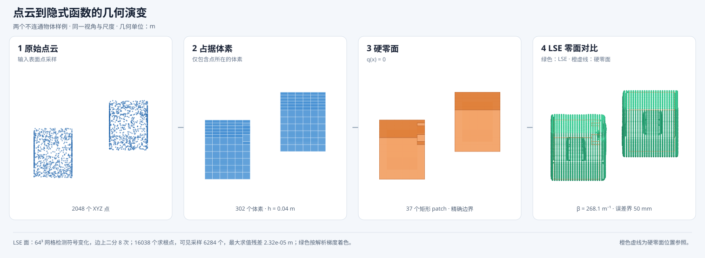

# 两个不连通点云的构建与可视化

这个例子把两组互不接触的盒表面点放在同一个 XYZ 文件中。算法不要求输入只有一个
连通分量；体素化后得到的集合可写成

$$
V=V_1\cup V_2,\qquad V_1\cap V_2=\varnothing.
$$

输入文件为 [`two_objects_surface.xyz`](../data/point_cloud_cases/two_objects_surface.xyz)，
共 2048 个点。两个解析采样盒分别为

$$
[-0.30,-0.10]\times[-0.10,0.10]\times[0.52,0.72]
$$

和


$$
[0.10,0.30]\times[-0.10,0.10]\times[0.68,0.88]\ \mathrm m.
$$

使用 $h=0.04\,\mathrm m$ 的体素和 $0.05\,\mathrm m$ 的 LSE 标量误差预算：

```bash
build/build_halfspace_tree \
  data/point_cloud_cases/two_objects_surface.xyz \
  output/two_objects_visualization_50mm \
  --pipeline octree \
  --tree-source boundary \
  --boundary-expression direct \
  --boundary-query dag \
  --voxel-size 0.04 \
  --distance-field lse \
  --lse-error 0.05 \
  --execution-sharing structural \
  --lse-kernel binary \
  --validation-cache auto \
  --sign-propagation packed

python3 scripts/visualize_point_cloud_pipeline.py \
  --input data/point_cloud_cases/two_objects_surface.xyz \
  --artifacts output/two_objects_visualization_50mm \
  --output docs/assets/two_objects_pipeline_demo.svg
```



本次结果包含 302 个占据体素。按共享面作 6 邻接检查，两个分量分别包含 152 和
150 个体素；即使把共享边或顶点也计作相连，仍为两个分量。完整符号证书通过，硬函数
的零面就是这两个闭体素分量的边界。

LSE 参数为 $\beta=268.1072500390346\,\mathrm m^{-1}$。在图中使用的 $64^3$ 采样域内，
集合 $\{\mathbf x:d_\beta(\mathbf x)\leq0\}$ 也得到两个 6 邻接分量。对分隔平面
$x=0$ 作 $161\times161$ 采样，最小值为

$$
\min d_\beta(0,y,z)=0.0404284\,\mathrm m>0,
$$

所以图示采样范围内保留了明确的自由空间间隙。这个结果是该输入和该平滑参数下的
数值检查；一般情况下，若物体间距变小或继续放宽误差预算，LSE 零面仍可能合并。

构建和验证指标见
[`benchmark.json`](../output/two_objects_visualization_50mm/benchmark.json)。
