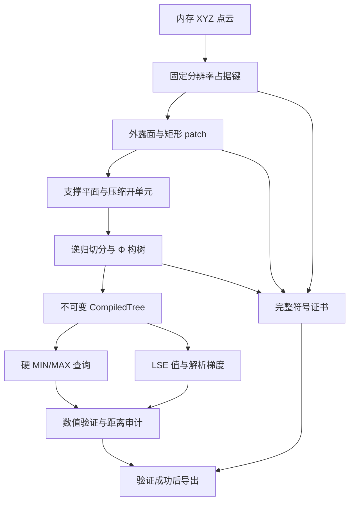
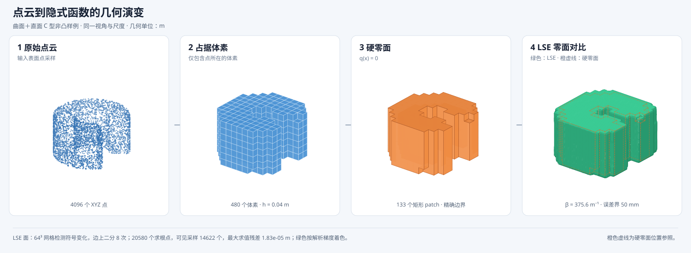

# 点云到半空间隐式函数：算法、公式与工程实现

版本日期：2026-09-10。对应当前 `boundary-direct` 路径及已完成的七项优化。
公式使用 LaTeX：行内公式以 `$...$` 包围，独立公式以 `$$...$$` 包围。

## 1. 目标、范围与输出约定

本方法将以米为单位的三维点云转换为可查询的隐式函数。首先建立固定分辨率的闭占据
体素并集，再由其真实边界平面构造 MIN/MAX 表达式，最后编译为可共享的执行程序。
同一个程序支持硬函数、平滑函数值和平滑函数的解析梯度。

本文对应如下命令行路径：

```text
--pipeline octree --tree-source boundary --boundary-expression direct
```

这里的 `octree` 是兼容现有入口的路由名称。该 direct 路径实际使用排序去重的稀疏
体素键，不建立八叉树层次，也不经过 Alpha Wrap、Nef 分解或 flat 扫描构造。
其他后端仍保留，本文的符号结论与性能数字不直接适用于那些后端。

设占据集合为 $V$，自由空间为 $\mathcal F=\mathbb R^3\setminus V$。硬函数约定为：

$$
q(\mathbf x)
\begin{cases}
<0,& \mathbf x\in\mathcal F,\\
=0,& \mathbf x\in\partial V,\\
>0,& \mathbf x\in\operatorname{int}V.
\end{cases}
\tag{1}
$$

为了使距离代理采用“自由空间为正”的习惯，定义：

$$
d_0(\mathbf x)=-q(\mathbf x),\qquad
d_\beta(\mathbf x)=-q_\beta(\mathbf x).
\tag{2}
$$

$q_\beta$ 是后文定义的单侧 LSE 平滑函数。硬分类使用 $q<0$，平滑保守分类使用
$d_\beta>0$。$d_\beta\leq0$ 可能包含边界外的一部分自由空间，不能作为精确占据判定。

整个几何目标是**输入点生成的体素集合**。表面点云不会自动填充为解析实体，
未观测空间也不会凭空变成物体内部。当前输入及其采样方式见
[20 场景输入说明](point_cloud_input_tests.md)。

## 2. 主要符号与处理流程

| 符号 | 含义 | 单位 |
| --- | --- | --- |
| $\mathcal P=(\mathbf p_i)_{i=1}^{n}$ | 输入点云序列，允许重复点 | 坐标为 m |
| $h$ | 固定体素边长 | m |
| $\mathcal K,\ N_v=\lvert\mathcal K\rvert$ | 排序去重后的整数占据键及其数量 | 无量纲 |
| $F,\ R$ | 外露单位面数、合并矩形 patch 数 | 无量纲 |
| $m_a$ | 第 $a$ 个轴上的唯一边界支撑坐标数 | 无量纲 |
| $C,\ S$ | 压缩三维开单元数、全维度 stratum 数 | 无量纲 |
| $U_s,E_s$ | 序列化原 DAG 的节点数、子引用数 | 无量纲 |
| $U,E$ | 结构共享后的执行节点数、子引用数 | 无量纲 |
| $\beta$ | LSE 参数 | $\mathrm m^{-1}$ |
| $\varepsilon$ | 请求的平滑标量误差预算 | m |





上图由额外的 `c_bracket_surface` 表面点云和已认证导出物直接生成，四幅图使用同一
视角与尺度。该点云是挤出的 C 型环形支架：内外圆柱壁为曲面，顶面、底面和开口
两侧为平面；中央孔和 $70^\circ$ 开口构成非凸结构。输入包含 4096 个表面点，第二幅
显示 $h=0.04\,\mathrm m$ 的 480 个占据体素；第三幅显示硬函数的精确零集
$q(\mathbf x)=0=\partial V$。绘图时将外露单位面按深度排序并用同色边缘消除抗锯齿缝，
再对共面 patch 并集的轮廓执行视线遮挡检查，只描绘当前视角可见的真实轮廓，因此既不
显示 patch 划分产生的内部接缝，也不会让背后轮廓穿透前景；第四幅解析导出的树和
$\beta$，在 $64^3$ 网格上检测符号变化并沿网格边二分求取
$d_\beta(\mathbf x)=0$。可见求根点扩展为相互覆盖的绿色表面采样，并使用式（28）的
解析梯度作为法向进行明暗着色；经过遮挡处理的橙色虚线叠加显示硬零面位置，便于直接
观察两种零面的偏移和圆滑程度。为了更清楚地显示平滑过渡，本图将
平滑标量误差预算放宽为 $0.05\,\mathrm m$，对应
$\beta\approx375.61\,\mathrm m^{-1}$。审计采样的最大标量平滑误差为
$38.30\,\mathrm{mm}$，且单侧保守关系仍成立。64 条诊断射线中 38 条括住零点；其余
26 条在搜索段内未找到零点，其中 14 条被其他占据区域阻断。已括住零点到硬边界的最大参考距离为
$42.02\,\mathrm{mm}$。这也说明标量误差预算不能直接视为零面的几何位移上界。可用
[点云生成脚本](../scripts/generate_c_bracket_surface.py)和
[可视化脚本](../scripts/visualize_point_cloud_pipeline.py)确定性重新生成。

程序内部先完成函数构建，再执行验证。本文“到函数耗时”在验证开始前结束；
这是一种计时口径，现有 CLI 的完整符号认证仍必须成功才会导出可用入口。

## 3. 从点云到闭体素集合

### 3.1 整数索引与浮点网格平面

理想实数网格中，点的所属键为逐轴向下取整：

$$
\mathbf k(\mathbf p)=
\left(
\left\lfloor\frac{p_x}{h}\right\rfloor,
\left\lfloor\frac{p_y}{h}\right\rfloor,
\left\lfloor\frac{p_z}{h}\right\rfloor
\right)\in\mathbb Z^3.
\tag{3}
$$

实现对十进制体素尺寸作了额外处理。设实际导出的 double 网格平面为

$$
g_h(k)=\operatorname{fl}\!\left(\operatorname{double}(k)\,h\right).
\tag{4}
$$

初始索引由高精度商的 floor 得到，然后根据实际平面校正，要求：

$$
g_h(k_a)\leq p_a<g_h(k_a+1),\qquad a\in\{0,1,2\}.
\tag{5}
$$

因此，点所属单元采用半开区间，避免同一原始点被重复分配。空点云、非有限坐标、非法 $h$、
超出支持范围的索引，以及不可区分的相邻浮点平面都会被拒绝。具体逻辑见
[conservative_voxelization.cpp](../src/conservative_voxelization.cpp)。

### 3.2 几何集合采用闭区间

点归属规则与几何占据规则分开定义：

$$
\mathcal K=\operatorname{unique}\{\mathbf k(\mathbf p_i)\}_{i=1}^{n},
\qquad
Q_{\mathbf k}=\prod_{a=0}^{2}[g_h(k_a),g_h(k_a+1)],
\qquad
V=\bigcup_{\mathbf k\in\mathcal K}Q_{\mathbf k}.
\tag{6}
$$

闭体素定义确保边界点属于占据集合。查询点恰落在网格平面时，占据查询会考察相邻
候选闭体素，每轴至多两个，三维至多八个。由构造得到 $\mathcal P\subseteq V$；
原始点包含性还会独立核对。

`SparseVoxelOccupancy` 只保留占据键、体素尺寸和查询所需范围。建立键的主要成本为
$O(n\log n)$ 的排序和去重；点重排或重复不改变 $\mathcal K$。实现见
[sparse_voxel_occupancy.cpp](../src/sparse_voxel_occupancy.cpp)。

## 4. 外露面、矩形合并与支撑平面

### 4.1 精确消除内部面

令 $\mathbf e_a$ 为坐标轴单位向量，$\sigma\in\{-1,+1\}$。体素 $\mathbf k$ 的有向面
保留当且仅当：

$$
\mathbf k+\sigma\mathbf e_a\notin\mathcal K.
\tag{7}
$$

若两个体素共享一个面，该面的两个有向出现项均被删除。只在边或顶点接触的体素
不会因此丢失面面积；空腔的内壁同样属于外露面。

有向面的整数平面坐标为
$c=k_a+\mathbf 1_{\{\sigma=+1\}}$，横向坐标为
$u=k_{(a+1)\bmod3}$、$v=k_{(a+2)\bmod3}$。
该面位于 $x_a=g_h(c)$，法向为 $\sigma\mathbf e_a$。

### 4.2 保持原划分的 patch 合并

当前实现将面分到六个朝向桶，在各桶内按 $(c,v,u)$ 排序，然后按行提取连续区间。
仅当相邻行的区间端点完全相同时才延长已有矩形：

$$
[u_0,u_1)\times[v_0,v_1)
\ \cup\
[u_0,u_1)\times[v_1,v_1+1)
=
[u_0,u_1)\times[v_0,v_1+1).
\tag{8}
$$

式（8）是单位面索引域中的关系，导出的几何矩形包含其边界。
两个可复用行缓冲通过单调游标匹配区间；断行、空洞、端点变化或不同朝向都不会跨越。
face ID、patch 创建顺序及来源 face ID 顺序与旧有序 map 实现一致。
合并时间上界为 $O(F\log F)$，辅助空间为 $O(F)$，不扫描稀疏包围盒中的空体素。

每个 patch 记录轴、朝向、平面坐标、矩形范围和全部来源面。验证要求所有外露单位面
恰好被一个 patch 覆盖，并核对矩形面积与来源数量。实现见
[octree_boundary.cpp](../src/octree_boundary.cpp)。

### 4.3 支撑注册

每个轴收集真实外露面所处的唯一整数平面坐标：

$$
\mathcal C_a=\{c_{a,0}<c_{a,1}<\cdots<c_{a,m_a-1}\}.
\tag{9}
$$

同一几何平面的正、负法向来源合并到同一 support，其朝向以位掩码保留。注册器先对
坐标数组排序去重，再按原 patch 顺序向 support 追加来源，保证编号确定性。

这些平面是构树可用的支撑来源。非凸集合的全部支撑面不能直接拼成一个全局 MAX
并当作原集合；后续的递归组合负责表达凹口、空腔和分离结构。

## 5. 压缩开单元与递归切分

### 5.1 压缩排列

每个轴由 $\mathcal C_a$ 产生 $m_a+1$ 个开区间，包括两端无界区间：

$$
I_{a,0}=(-\infty,g_h(c_{a,0})),\qquad
I_{a,j}=(g_h(c_{a,j-1}),g_h(c_{a,j})),\quad 1\leq j<m_a,
$$

$$
I_{a,m_a}=(g_h(c_{a,m_a-1}),+\infty),\qquad
A_{\mathbf j}=I_{0,j_0}\times I_{1,j_1}\times I_{2,j_2},
\qquad
C=\prod_{a=0}^{2}(m_a+1).
\tag{10}
$$

每个 $A_{\mathbf j}$ 的占据状态必须均匀。对于有界单元，其包含的细网格单元容量为：

$$
W_{\mathbf j}=
\prod_{a=0}^{2}\left(c_{a,j_a}-c_{a,j_a-1}\right).
\tag{11}
$$

将所有占据键计入所在压缩单元，得到 $M_{\mathbf j}$。实现要求
$M_{\mathbf j}\in\{0,W_{\mathbf j}\}$：零表示全自由，等于容量表示全占据，其他值拒绝。
无界外部单元全部标记为自由。这里比较的是整数单元数量，不是浮点物理体积。

### 5.2 前缀和与切分评分

设压缩开单元的占据指示量为 $o(\mathbf j)\in\{0,1\}$，三维前缀和为：

$$
P(i,j,k)=
\sum_{\substack{0\leq u<i\\0\leq v<j\\0\leq w<k}}o(u,v,w).
\tag{12}
$$

区域 $B=[\boldsymbol\ell,\mathbf u)$ 的占据单元数由八个角的容斥求出：

$$
\operatorname{occ}(B)=
\sum_{\boldsymbol\eta\in\{0,1\}^3}
(-1)^{3-\sum_a\eta_a}
P(t_0(\eta_0),t_1(\eta_1),t_2(\eta_2)),
\quad t_a(0)=\ell_a,\quad t_a(1)=u_a.
\tag{13}
$$

全自由或全占据区域直接返回构造期标签；混合区域枚举内部真实支撑平面。候选切分
将区域分为 $B_L,B_R$，按以下元组的字典序取最小值：

$$
\operatorname{score}(a,k)=
\left(
\mathbf 1_{\{B_L\text{ 混合}\}}+\mathbf 1_{\{B_R\text{ 混合}\}},
\max(|B_L|,|B_R|),
a,k
\right).
\tag{14}
$$

$|B_L|,|B_R|$ 是压缩单元数。算法先减少混合子区域，再平衡单元数，最后用轴和
切分位置打破平局。此启发式是确定性的，不保证最小表达树。

## 6. 硬 MIN/MAX 函数构造及符号性质

### 6.1 叶函数

对支撑 $(a,c)$ 和系数方向 $\tau\in\{-1,+1\}$，构造：

$$
\ell_{a,c,\tau}(\mathbf x)
=\tau\bigl(x_a-g_h(c)\bigr)
=\mathbf n^\mathsf T\mathbf x-b,\qquad
\mathbf n=\tau\mathbf e_a,\quad b=\tau g_h(c),\quad \|\mathbf n\|_2=1.
\tag{15}
$$

同一支撑的两个系数方向按需生成并缓存；它们共享真实边界支撑的来源信息。
表达式只使用 LEAF、MIN、MAX 三类节点。

### 6.2 分支组合算子

设切分函数为 $s(\mathbf x)=x_a-g_h(c)$，负侧子函数为 $a(\mathbf x)$，正侧为
$b(\mathbf x)$。两个孩子均为表达式时：

$$
\boxed{
\Phi(s,a,b)=
\max\!\left\{
\min(a,b),\
\min(a,-s),\
\min(s,b)
\right\}.}
\tag{16}
$$

省略自变量 $\mathbf x$ 时，各字母均表示该点处的标量值。若 $s<0$，有 $-s>0$：
当 $a>0$ 时第二项为正；当 $a=0$ 时第二项为零且其余项非正；当 $a<0$ 时三项均负。
因此：

$$
\operatorname{sgn}\Phi(s,a,b)=
\begin{cases}
\operatorname{sgn}(a),&s<0,\\
\operatorname{sgn}(b),&s>0,\\
-1,&s=0,\ a<0,\ b<0,\\
+1,&s=0,\ a>0,\ b>0,\\
0,&s=0\text{ 且不属于上述两个同号情形}.
\end{cases}
\tag{17}
$$

这使切分面两侧全自由时仍保持严格负值，两侧全占据时保持严格正值，不把内部切分面
自动变成零面。对子区域闭包递归应用，并对面、边、顶点的全部邻接开单元归纳，可得到
式（1）的几何符号性质；实现另外通过第 9 节的完整证书核对。

### 6.3 构造期常量折叠

FREE、OCCUPIED 是类型标签，代数解释分别为 $-\infty,+\infty$。
最终程序不包含这些无穷常量，也不以有限大数代替。

| 左孩子 | 右孩子 | 折叠结果 |
| --- | --- | --- |
| FREE | FREE | FREE |
| OCCUPIED | OCCUPIED | OCCUPIED |
| FREE | OCCUPIED | $s$ |
| OCCUPIED | FREE | $-s$ |
| FREE | $b$ | $\min(s,b)$ |
| OCCUPIED | $b$ | $\max(b,-s)$ |
| $a$ | FREE | $\min(a,-s)$ |
| $a$ | OCCUPIED | $\max(a,s)$ |

左右表达式指针相同时直接复用该表达式。构造结束后 `tree.raw` 与 `tree.simplified`
指向同一结果，不运行额外的全局化简。实现见
[boundary_direct_tree.cpp](../src/boundary_direct_tree.cpp)。

## 7. 单侧 LSE 平滑、误差界与解析梯度

### 7.1 两种上界算子

对于 $k$ 个子值 $\mathbf z=(z_1,\ldots,z_k)$、$\beta>0$，定义：

$$
\operatorname{MAX}^{+}_\beta(\mathbf z)
=\frac{1}{\beta}\log\sum_{i=1}^{k}e^{\beta z_i},
\qquad
\operatorname{MIN}^{+}_\beta(\mathbf z)
=-\frac{1}{\beta}\log\left(\frac{1}{k}\sum_{i=1}^{k}e^{-\beta z_i}\right).
\tag{18}
$$

MIN 中的均值归一化非常关键。两种算子满足：

$$
\max_i z_i\leq \operatorname{MAX}^{+}_\beta(\mathbf z)
\leq\max_i z_i+\frac{\log k}{\beta},
$$

$$
\min_i z_i\leq \operatorname{MIN}^{+}_\beta(\mathbf z)
\leq\min_i z_i+\frac{\log k}{\beta}.
\tag{19}
$$

未归一化的常见 soft-min 是硬 MIN 的下界，不能直接替换式（18）中的 MIN。
将硬树中的每个内部节点替换为相应上界算子，保持叶子和有序子引用不变，得到
$q_\beta$。由于两个算子对每个输入均单调，逐层归纳可得：

$$
q_\beta(\mathbf x)\geq q(\mathbf x),
\qquad
d_\beta(\mathbf x)\leq d_0(\mathbf x).
\tag{20}
$$

结合式（1），$d_\beta>0$ 只能发生在自由空间，构成实数模型中的单侧保守判据。

### 7.2 路径累计误差

两个平滑算子均满足平移等变性：
$A_\beta(\mathbf z+t\mathbf 1)=A_\beta(\mathbf z)+t$。
若子节点误差分别不超过 $\delta_i$，由单调性、平移等变性及式（19），父节点误差
不超过 $\max_i\delta_i+\log k/\beta$。

因此可在同一 DAG 上递推误差权重：

$$
W_v=
\begin{cases}
0,&v\text{ 为叶子},\\
\displaystyle\max_{u\in\operatorname{children}(v)}W_u+\log k_v,
&v\text{ 为内部节点}.
\end{cases}
\tag{21}
$$

根节点为 $r$，则：

$$
0\leq d_0(\mathbf x)-d_\beta(\mathbf x)
=q_\beta(\mathbf x)-q(\mathbf x)
\leq\varepsilon_\beta,\qquad
\varepsilon_\beta=\frac{W_r}{\beta}.
\tag{22}
$$

给定预算 $\varepsilon>0$，当 $W_r>0$ 时选择
$\beta\geq W_r/\varepsilon$ 即满足解析误差预算。实现使用 long double 累计权重，
自动参数转换后用 `nextafter` 向上调整 $\beta$，报告误差也向上调整一个相邻 double。
纯叶节点的 $W_r=0$，平滑误差为零。

由式（22）还得到自由区域的包含关系：

$$
\{\mathbf x:d_0(\mathbf x)>\varepsilon_\beta\}
\subseteq
\{\mathbf x:d_\beta(\mathbf x)>0\}
\subseteq
\mathcal F.
\tag{23}
$$

在原体素边界上，$d_0=0$，故
$-\varepsilon_\beta\leq d_\beta\leq0$。平滑零面通常与原边界不同。
$\varepsilon$ 控制的是平滑前后**标量值的差**，不能直接解释为欧氏 SDF 误差、
几何膨胀厚度或 Hausdorff 距离。

### 7.3 稳定数值实现

选取极值出现项作为 anchor $A$：MAX 取最大值，MIN 取最小值；并列时保留第一个出现项。
对其余子项定义非负 gap：

$$
\Delta_i=
\begin{cases}
A-z_i,&\text{MAX},\\
z_i-A,&\text{MIN},
\end{cases}
\qquad
t=\sum_{i\ne i_*}e^{-\beta\Delta_i}.
\tag{24}
$$

只计算非正指数，结果改写为：

$$
\operatorname{MAX}^{+}_\beta
=A+\frac{\operatorname{log1p}(t)}{\beta},
$$

$$
\operatorname{MIN}^{+}_\beta
=A+\frac{1}{\beta}
\operatorname{log1p}\!\left(\frac{k-1-t}{1+t}\right).
\tag{25}
$$

在实数算术下 $0\leq t\leq k-1$，两种修正均非负。MIN 的这种形式避免相近对数相减；
全部子值相同时修正恰为零。代码没有用硬截断把结果强行夹到原硬值上。

当 $k=2$ 时，只需一个指数项：

$$
e=e^{-\beta\Delta},\qquad
c_{\max}=\frac{\operatorname{log1p}(e)}{\beta},\qquad
c_{\min}=\frac{\operatorname{log1p}((1-e)/(1+e))}{\beta}.
\tag{26}
$$

二元内核保留通用内核的 anchor 选择、减法方向、累加和除法顺序，仅去除通用扫描开销。
过大的正 $\beta\Delta$ 允许产生 $e=0$；非有限平滑值或梯度会被拒绝。

### 7.4 梯度递推

令 $\sigma_v=+1$ 表示 MAX，$\sigma_v=-1$ 表示 MIN。其归一化权重为：

$$
w_i=
\frac{e^{\sigma_v\beta z_i}}
{\sum_{j=1}^{k}e^{\sigma_v\beta z_j}},
\qquad w_i\geq0,\qquad\sum_{i=1}^{k}w_i=1.
\tag{27}
$$

归一化 MIN 只比未归一化 soft-min 多一个常数，所以其导数仍是同一组指数权重。
使用链式法则：

$$
\nabla q_{\beta,v}(\mathbf x)=
\begin{cases}
\mathbf n_v,&v\text{ 为叶子},\\
\displaystyle\sum_{i=1}^{k_v}w_i\nabla q_{\beta,i}(\mathbf x),
&v\text{ 为内部节点},
\end{cases}
\qquad
\nabla d_\beta(\mathbf x)=-\nabla q_{\beta,r}(\mathbf x).
\tag{28}
$$

实际实现以 anchor 权重为 $1$，用移位指数累加其余梯度，再统一除以 $1+t$。
每条子引用都参与加权，包括重复引用。

令 $L=\max_\ell\|\mathbf n_\ell\|_2$。梯度是子梯度的凸组合，故实数模型中：

$$
\|\nabla d_\beta(\mathbf x)\|_2\leq L.
\tag{29}
$$

当前 direct 叶法向量均为单位轴向量，因此 $L=1$。有限 $\beta$ 对应的实数函数为
$C^\infty$；梯度可以变小或为零，不保证其范数等于 $1$。程序返回相对于世界坐标
$x,y,z$ 的梯度，不自动归一化。实现见
[halfspace_smooth_tree.hpp](../include/rokae_demo/halfspace_smooth_tree.hpp)。

## 8. DAG 编译与统一执行程序

### 8.1 存储共享与求值共享

式（16）会多次引用相同子表达式。只共享表达式对象可以减少存储，却不能阻止递归
查询重复计算。`CompiledTree` 将可达 DAG 按子节点先于父节点的次序编译为连续指令，
保存平面系数与子引用数组。单点查询由一次顺序扫描完成，每个执行节点只求值一次：

$$
T_{\mathrm{hard}}=O(U+E),\qquad
T_{\mathrm{LSE}}=O(U+E),\qquad
M_{\mathrm{workspace}}=O(U).
\tag{30}
$$

LSE 的常数成本较高，因为包含指数、对数和可选梯度加权。有效单点查询的核心循环
不递归、不做哈希查询、不分配堆内存；结果缓冲由调用者预先创建并重复使用。

### 8.2 结构共享保留表达式语义

执行层相同子表达式按以下完整键判等：

$$
K(v)=
\begin{cases}
(\mathrm{LEAF},\operatorname{leafID}(v)),&v\text{ 为叶子},\\
(\operatorname{op}(v),K(c_1),\ldots,K(c_k)),&v\text{ 为内部节点}.
\end{cases}
\tag{31}
$$

实际实现使用已映射的孩子 ID，并以哈希选择候选桶、完整比较确认相等。
顺序、运算符、叶 ID 和子引用重数全部保留，不做近似系数匹配或布尔代数重写。

保留重数是平滑函数不变的必要条件。例如：

$$
\max(a,a)=a,\qquad
\operatorname{MAX}^{+}_\beta(a,a)=a+\frac{\log2}{\beta}.
\tag{32}
$$

因此，硬树的幂等化简不一定保持 LSE 值。归一化 MIN 的分组变化也会改变权重，
不能任意展平或重新结合。构造期折叠先确定最终硬树，平滑语义绑定这棵树及其 $\beta$。

### 8.3 一份程序服务三类任务

硬查询、`SmoothTree` 和距离审计共用
`std::shared_ptr<const CompiledTree>`。`SmoothTree` 只增加平滑参数与误差信息，
不重复复制指令和系数。构造时核对结构共享配置是否匹配。

原相机输入的序列化 DAG 有 524 个节点，结构共享后执行程序为 429 个节点；
递归展开的节点引用数与两者不同，不能用存储节点数代替递归工作量。
实现见 [halfspace_compiled_tree.hpp](../include/rokae_demo/halfspace_compiled_tree.hpp)。

## 9. 完整符号证书与 64 位批量传播

### 9.1 覆盖所有维度的 strata

每个轴除 $m_a+1$ 个开区间外，还包含 $m_a$ 个平面位置，共 $2m_a+1$ 个一维元素。
它们的笛卡尔积覆盖三维体、面、边、顶点及无界部分：

$$
S=\prod_{a=0}^{2}(2m_a+1).
\tag{33}
$$

实现将偶数索引编码为开区间，奇数索引编码为固定平面。对 stratum 索引
$\mathbf j=(j_0,j_1,j_2)$：

$$
\dim(\mathbf j)=3-\sum_{a=0}^{2}(j_a\bmod2).
\tag{34}
$$

所有叶子平面的符号在每个 stratum 上恒定，MIN/MAX 的符号由离散
$\{-1,0,+1\}$ 传播即可求得。设 $\mathcal A(\mathbf j)$ 为邻接开三维单元集合，
$o(A)$ 为其占据指示量，期望符号是：

$$
s_{\mathrm{expected}}(\mathbf j)=
\begin{cases}
-1,&\forall A\in\mathcal A(\mathbf j),\ o(A)=0,\\
+1,&\forall A\in\mathcal A(\mathbf j),\ o(A)=1,\\
0,&\text{其余情况}.
\end{cases}
\tag{35}
$$

证书核对每个 stratum 的表达式符号与式（35）一致，同时核对边界来源、压缩单元
均匀性及叶子系数。这样才能排除真实边界错误，以及人工自由/占据接缝上的错误零值。

### 9.2 packed 符号传播

每批至多 64 个 strata。每个节点用两个位掩码 $N_v,P_v$ 分别表示严格负与严格正：

$$
\begin{aligned}
\mathrm{MIN}:&\quad N_v=\bigvee_i N_i,\quad P_v=\bigwedge_i P_i,\\
\mathrm{MAX}:&\quad N_v=\bigwedge_i N_i,\quad P_v=\bigvee_i P_i.
\end{aligned}
\tag{36}
$$

设当前批有效位掩码为 $B$，零符号掩码为
$Z_v=B\mathbin{\&}\neg(N_v\mathbin{|}P_v)$。
这是同一离散逻辑的机器字实现，不丢弃低维 strata，也不改变逐点统计。
`--sign-propagation scalar` 保留逐 stratum 对照路径。

原始树与简化树指针相同时无需再次传播同一个 DAG。packed 主要减少运算节点的传播
成本；stratum 枚举、叶符号和结果统计仍有成本，不能把理论位宽当成整体 64 倍加速。
工作量上限继续按原始逻辑工作量计算。实现见
[boundary_local_tree.cpp](../src/boundary_local_tree.cpp)。

### 9.3 证书的数值边界

上述有限证书对应已注册平面所定义的实数 MIN/MAX 函数。double 网格平面和系数是该
模型的输入常量。另有世界坐标测试核对实际浮点求值，包括原始点、体素角点、边界
附近及随机点；原生测试还包含 `nextafter` 邻点。

这不等于任意坐标范围下的浮点区间算术证明。LSE 使用标准数学库，式（20）和式（22）
是解析公式性质；数值实现通过运行时检查和采样审计核对，未采用经认证的区间指数/
对数库。平滑误差、浮点误差与采样几何误差应分别理解。

## 10. 距离参考、数值审计与探针缓存

### 10.1 有限矩形距离参考

对第 $r$ 个矩形 patch，记包围范围为
$[\mathbf l_r,\mathbf u_r]$，其中法向轴的上下界相等。点到该有限矩形的距离为：

$$
\delta_{r,a}(\mathbf x)=\max(l_{r,a}-x_a,\ 0,\ x_a-u_{r,a}),\qquad
\rho_r(\mathbf x)=\sqrt{\sum_{a=0}^{2}\delta_{r,a}(\mathbf x)^2}.
\tag{37}
$$

完整边界距离及其符号定义为：

$$
\rho(\mathbf x)=\min_r\rho_r(\mathbf x),\qquad
d_{\mathrm{ref}}(\mathbf x)=
\begin{cases}
\rho(\mathbf x),&\mathbf x\notin V,\\
0,&\mathbf x\in\partial V,\\
-\rho(\mathbf x),&\mathbf x\in\operatorname{int}V.
\end{cases}
\tag{38}
$$

`BoundaryDistanceReference` 遍历有限矩形计算该参考值，其单点面片距离成本为 $O(R)$，
符号还需占据查询。参考只用于验证，不进入 $d_\beta$ 或梯度的计算。实现见
[boundary_distance_reference.hpp](../include/rokae_demo/boundary_distance_reference.hpp)。

单位平面法向不意味着半空间组合等于欧氏距离。例如轴对齐盒的常见平面代理
$\max_i(|x_i|-a_i)$，在两个坐标方向各超出盒面 $t>0$ 时返回 $t$，到盒的欧氏距离
却为 $\sqrt2\,t$。硬 MIN/MAX 具有 1-Lipschitz 性质，结合其精确零集，在实数模型中
可以推得 $|d_0(\mathbf x)|\leq\rho(\mathbf x)$，但这不是距离相等或反向误差上界。

### 10.2 审计项目

三个误差量分别记录：

$$
e_{\mathrm{smooth}}=|d_\beta-d_0|,\qquad
e_{\mathrm{hard}}=|d_0-d_{\mathrm{ref}}|,\qquad
e_{\mathrm{SDF}}=|d_\beta-d_{\mathrm{ref}}|.
\tag{39}
$$

探针覆盖全部原始点、体素中心与角点、patch 中心及两侧、确定性外部棱角位置和
固定种子随机点。另报告真实边界值偏差、内外及近边界误差、梯度范数等。

梯度有限差分的目标步长为：

$$
s_{\mathrm{fd}}=\min(10^{-4}h,\ 10^{-3}/\beta),\qquad
g_a^{\mathrm{fd}}=
\frac{d_\beta(\mathbf x^+)-d_\beta(\mathbf x^-)}
{x_a^+-x_a^-}.
\tag{40}
$$

$\mathbf x^\pm$ 仅第 $a$ 个坐标按步长偏移；分母使用实际可表示的浮点坐标差。
不可表示的步长单独统计，所请求检查全部不可表示时拒绝验证。

零面射线从选定 patch 中心沿外法向发出，在 $[0,2h]$ 上寻找首次采样异号区间，
成功后做二分。被其他占据区域阻断或未找到区间的射线仍保留在结果中。
这是一项采样诊断，不是全局 Hausdorff 距离证书。

### 10.3 精确坐标缓存

同一快照中重复探针的硬值、平滑值、梯度与参考距离按坐标位模式匹配：

$$
K_{\mathrm{probe}}(\mathbf x)=
\bigl(\operatorname{bits}(x),\operatorname{bits}(y),\operatorname{bits}(z)\bigr).
\tag{41}
$$

因此相邻 double 不混用，$+0$ 与 $-0$ 也保持区别。硬值缓存持有不可变程序引用，
避免程序地址复用造成快照混淆。前一验证阶段已计算的硬值可继续复用。

缓存仅减少重复计算。每次探针出现仍写入结果、参与统计并扣除原有工作量预算。例如：

$$
\operatorname{RMSE}
=\sqrt{\frac{1}{N_{\mathrm{probe}}}
\sum_{i=1}^{N_{\mathrm{probe}}}e_i^2}
\tag{42}
$$

中的 $N_{\mathrm{probe}}$ 包含重复出现项，不按唯一坐标数重新加权。
`--validation-cache auto|none|exact` 控制该优化；auto 对小程序避免缓存开销，
当前阈值采用平滑工作量估计 $U+3E\geq256$。实现见
[boundary_smooth_distance.cpp](../src/boundary_smooth_distance.cpp)。

## 11. 多帧复用、批量查询与七项优化

### 11.1 多帧快照

`BoundaryDirectFrameCache` 用以下内容精确匹配可复用快照：

$$
K_{\mathrm{frame}}=
\bigl(\operatorname{bits}(h),\mathcal K,
\text{构建与证书配置},\text{执行共享配置},\text{LSE 配置},\text{缓存配置}\bigr).
\tag{43}
$$

每帧仍从新的原始点云构建占据键，并检查全部原始点属于选中的闭占据集合。
同一体素内的点移动、点顺序变化或重复点不一定改变 $\mathcal K$，因此可以命中；
任一占据键或参与匹配的配置变化都导致重建并重新认证。

命中时复用边界、direct 树、符号证书、编译程序、平滑对象、距离参考、硬值验证缓存
和查询工作区。LRU 容量受限；外部持有的 shared_ptr 使被淘汰快照仍保持有效。
这不是增量修改树的算法，变化帧仍走完整重建。

程序和几何可以只读共享，但快照中的工作区可变，面向单个 session/worker。
缓存对象和同一工作区不能由多个线程无同步地同时使用。接口见
[boundary_direct_frame_cache.hpp](../include/rokae_demo/boundary_direct_frame_cache.hpp)。

### 11.2 点级并行

批量 API 将 $B$ 个查询点按连续区间分给 $w$ 个 worker，每个点内部仍执行同一个标量
内核，输出保留输入顺序。实际工作线程数最多为 $\min(B,w)$。

用于理解成本的近似模型为：

$$
T_{\mathrm{batch}}\approx
T_{\mathrm{launch}}+
\left\lceil\frac{B}{w}\right\rceil T_{\mathrm{scalar}},
\qquad
M_{\mathrm{batch\ workspace}}=O(wU).
\tag{44}
$$

实际还受调度、负载和缓存影响。目前每批创建并回收线程，没有常驻线程池，也没有
SIMD 内核或自动占满硬件线程的策略。有效标量内核不分配堆内存，不代表整个批量调用
不分配线程和异常管理对象。

值工作区的数据负载约为每 worker $8U$ 字节，值加三维梯度约为 $32U$ 字节，
不含容器开销。不同并发批次必须分别持有输出和工作区。发生错误时会等待已启动线程
结束后重抛，输出可能只部分完成。实现见
[halfspace_batch.hpp](../include/rokae_demo/halfspace_batch.hpp)。

### 11.3 已完成优化与保持不变的内容

| 优化 | 当前实现 | 保持的性质 |
| --- | --- | --- |
| 1. 相同子表达式共享 | 完整键判等后合并执行指令 | 有序子引用、重数、系数和函数值 |
| 2. 二元 LSE 内核 | 两孩子节点按式（26）专用求值 | anchor、计算顺序与并列行为 |
| 3. 统一执行程序 | 硬查询、平滑和审计共享不可变程序 | 同一几何与系数快照 |
| 4. 验证加速 | 精确探针缓存、64 位符号传播 | 全 strata、探针出现次数和工作量预算 |
| 5. 多帧复用 | 精确占据/配置匹配和 LRU | 每帧体素化与原始点检查 |
| 6. 批量并行 | 按查询点分块，各 worker 独立工作区 | 输入顺序和每点标量算术 |
| 7. 前端容器优化 | 朝向桶、连续排序记录、可复用行缓冲 | patch 划分、编号和来源顺序 |

各阶段在不同版本与不同轮次测得的百分比不能相乘作为当前整体加速比。
详细记录见 [结构共享](execution_sharing_results.md)、
[二元内核](lse_binary_kernel_results.md)、
[统一程序](unified_execution_program_results.md)、
[验证加速](validation_acceleration_results.md)、
[多帧复用](multi_frame_reuse_results.md)、
[批量查询](batch_parallel_evaluation_results.md)和
[前端优化](boundary_frontend_results.md)。

## 12. C++ 接口与命令行使用

### 12.1 带符号证书的最小 C++ 示例

下面的示例展示完整的构建与查询接口。原始点和硬树的认证在查询前执行；
它不调用额外的完整距离审计。

```cpp
#include <rokae_demo/boundary_direct_tree.hpp>
#include <rokae_demo/halfspace_smooth_tree.hpp>
#include <iostream>
#include <memory>
#include <stdexcept>
#include <vector>

int main()
{
  using namespace rokae_demo;
  const std::vector<VoxelPoint> raw{
    {0.02, 0.02, 0.02}, {0.06, 0.02, 0.02}, {0.02, 0.06, 0.02}};
  const double h = 0.04;
  const auto occupancy = buildSparseVoxelOccupancy(raw, h);
  validateSparseVoxelOccupancy(occupancy, raw);
  const auto boundary = extractVoxelBoundary(occupancy.occupied_voxels);
  const auto direct = buildBoundaryDirectTree(occupancy, boundary);
  const auto certificate = validateBoundaryDirectTree(occupancy, boundary, direct);
  if(!certificate.applied || !certificate.strict_sign_certified)
    throw std::runtime_error("Uncertified direct tree");

  auto program = std::make_shared<const HS::CompiledTree>(
    direct.tree.raw, direct.tree.leaves, true);
  HS::SmoothTreeOptions options;
  options.max_error = 0.001;       // meters; beta remains zero
  options.share_subexpressions = true;
  options.binary_kernel = true;
  const HS::SmoothTree field(program, options);

  auto hard_work = program->makeWorkspace();
  auto gradient_work = field.makeGradientWorkspace();
  const HS::Vec3 p{0.12, 0.12, 0.02};
  const double q = program->evaluate(p, hard_work); // negative means free
  const auto sample = field.evaluateWithGradient(p, gradient_work);
  std::cout << q << ' ' << sample.value << ' '
            << sample.gradient.x << ' ' << sample.gradient.y << ' '
            << sample.gradient.z << '\n';

  const std::vector<HS::Vec3> queries{p, {0.02, 0.02, 0.02}};
  std::vector<HS::ValueGradient> results(queries.size());
  auto batch_work = field.makeGradientBatchWorkspace(2);
  field.evaluateWithGradientBatch(queries, results, batch_work);
}
```

上述代码已使用当前 Release 库编译运行。`q` 是硬根值，`sample.value` 已经是取负后的
$d_\beta$，`sample.gradient` 是 $\nabla d_\beta$，调用者无需再次取负。

旧的从表达式或序列化树构造 `SmoothTree` 的接口仍存在，但希望避免重复编译时应显式
传入已经创建的共享程序。库级 `SmoothTreeOptions` 的结构共享与二元开关默认关闭；
当前 direct CLI 默认开启这两项，所以示例显式指定相同配置。

连续帧可使用 `BoundaryDirectFrameCache::prepare()`，设置 `smooth=true`，并确保
`smoothing.share_subexpressions` 与帧级共享开关一致。使用前检查返回快照的证书，
再读取 `compiledProgram()`、`smoothTree()` 及对应工作区。

### 12.2 构建与单次运行

```bash
cmake -S . -B build -DBUILD_TESTING=ON -DCMAKE_BUILD_TYPE=Release
cmake --build build -j2

build/build_halfspace_tree data/point_cloud_cases/torus_surface.xyz output/torus_technical_new \
  --pipeline octree --tree-source boundary --boundary-expression direct \
  --boundary-query dag --voxel-size 0.04 \
  --distance-field lse --lse-error 0.001 \
  --execution-sharing structural --lse-kernel binary \
  --validation-cache auto --sign-propagation packed
```

$h=0.04\,\mathrm m$ 和 $\varepsilon=0.001\,\mathrm m$ 是当前基准配置，不是强制参数。
`--lse-beta` 与 `--lse-error` 必须且只能指定一个。未启用 `--distance-field lse` 时
只保留硬树；`exact` 这一 CLI 名称也不表示精确欧氏 SDF。

### 12.3 构建与验证预算

| 项目 | 当前默认值 |
| --- | ---: |
| 压缩开单元上限 | 16,384 |
| 构造期间分配节点上限 | 16,384 |
| 递归展开节点引用上限 | 262,144 |
| 候选切分检查上限 | 1,048,576 |
| direct 深度上限 | 128，参数最多允许 256 |
| 完整证书 strata 上限 | 200,000 |
| 符号操作估算上限 | 200,000,000 |
| 世界坐标探针工作量上限 | 1,000,000,000 |
| 距离审计工作量上限 | 100,000,000 |
| 附加梯度检查点数上限 | 128，每点至多三个方向 |
| 零面射线数上限 | 64 |

超限或证书失败时拒绝当前 direct 构建，不自动改用其他几何表达。未执行的证书
不能当作认证成功。输出目录应按运行分开，调用者必须检查退出码。

## 13. 计时定义与当前测试结果

### 13.1 “点云到函数”的准确边界

当前 `core_runtime_ms`，也即新输入报告中的 `function_ms`，覆盖：

$$
T_{\mathrm{function}}
\approx
T_{\mathrm{voxel}}+
T_{\mathrm{boundary}}+
T_{\mathrm{registry/canonical/tree}}+
T_{\mathrm{compile}}+
T_{\mathrm{LSE\ preparation}}.
\tag{45}
$$

式（45）表示工作范围；该字段实际由外层墙钟计时，不是相加子阶段中位数。
起点是已读入内存的点云，终点是硬程序、LSE 参数及查询工作区准备完成。
不包含文件读取、导出、任何验证、参考距离准备、首次查询或可选查询基准。

| 指标 | 范围 |
| --- | --- |
| `geometry_core_ms` | 体素化、边界、支撑、压缩和硬树构建 |
| `core_runtime_ms` / `function_ms` | 上述几何加共享程序、LSE 和工作区准备 |
| `validation_ms` | 几何/符号认证、世界探针及启用的距离验证 |
| `total_ms` | 核心构建到验证完成，不含输入/输出 I/O 和可选查询基准 |
| `input_io_ms`、`output_io_ms` | 分别记录输入与导出 |

不同指标的中位数通常不能直接相加还原总耗时中位数。
计时位置见 [boundary_direct_pipeline.cpp](../src/boundary_direct_pipeline.cpp)。

### 13.2 20 组输入的当前实测

2026-09-10，本机 Release，$h=0.04\,\mathrm m$，$\varepsilon=0.001\,\mathrm m$。
每组一次预热、七次正式运行，按轮轮换场景顺序，每次使用新进程重新构建。
验证采用 1000 个随机样本并保留原有全 strata、梯度及射线预算。
以下均为排除验证和读写的到函数中位数。

| 输入 | 点数 | 占据体素 | 执行节点 | 到函数 ms |
| --- | ---: | ---: | ---: | ---: |
| camera | 1655 | 341 | 429 | 1.017011 |
| cube_surface | 2048 | 324 | 23 | 0.510080 |
| l_surface | 2048 | 162 | 37 | 0.428970 |
| u_surface | 2048 | 222 | 51 | 0.473570 |
| thin_wall_surface | 2048 | 141 | 30 | 0.405171 |
| staircase_surface | 2048 | 361 | 87 | 0.623107 |
| two_objects_surface | 2048 | 302 | 85 | 0.606415 |
| narrow_corridor_surface | 2048 | 497 | 152 | 0.871351 |
| cylinder_surface | 2048 | 317 | 210 | 0.752842 |
| torus_surface | 2048 | 259 | 226 | 0.777868 |
| hollow_box_surfaces | 2048 | 588 | 382 | 1.131389 |
| plane_patch | 1024 | 80 | 11 | 0.195680 |
| ellipsoid_sparse | 256 | 169 | 473 | 0.717609 |
| ellipsoid_surface | 2048 | 339 | 410 | 1.064290 |
| ellipsoid_dense | 8192 | 378 | 330 | 1.665706 |
| ellipsoid_noise_2mm | 2048 | 341 | 424 | 1.020193 |
| ellipsoid_noise_8mm | 2048 | 416 | 497 | 1.157479 |
| ellipsoid_partial | 1024 | 174 | 213 | 0.575716 |
| ellipsoid_duplicates | 6144 | 339 | 410 | 1.641761 |
| ellipsoid_outliers | 2054 | 345 | 542 | 1.185258 |

所有输入的中位数范围为 **0.196–1.666 ms**。构造成本同时受原始点数、占据分布和
树结构影响：例如 256 点稀疏椭球的执行程序有 473 个节点，8192 点密集椭球有 330 个。
原相机输入本轮为约 1.017 ms；先前约 0.96 ms 属于另一轮测量，不能据此单独判断代码
性能变化。完整原始数据及协议见
[输入 benchmark](../output/point_cloud_input_benchmark_final/report.md)。

这些输入均为可复现合成点云。原相机基线是十视角带噪声椭球表面，中心
$(0,0,0.75)\,\mathrm m$，三轴尺寸 $0.36\times0.26\times0.48\,\mathrm m$；
其他场景包含盒并集、圆柱、环面、空腔、开放面以及密度、噪声、局部采样和离群点变化。
`2mm` 和 `8mm` 噪声版本的参数是各坐标轴标准差。输入参数和可视预览见
[manifest](../data/point_cloud_cases/manifest.json) 与
[点云预览](../data/point_cloud_cases/preview.svg)。

### 13.3 复用与查询时间是另外两类指标

2026-09-09 的独立相机帧复用基准测得命中准备约 **0.315 ms/帧**。
它包含当前帧体素化及原始点检查，复用已有几何和程序，不重新执行完整距离审计。
它不是式（45）中重新构建的耗时。

同日的 4096 点、8 worker 批量基准中，硬值、LSE 值和值加梯度分别约为
**0.354、3.216、4.037 µs/点**。这些是批次耗时除以点数的吞吐指标，包含该批线程创建，
不能作为单次独立查询的延迟。对应数据见
[帧复用基准](../output/multi_frame_reuse_benchmark/report.md) 和
[批量查询基准](../output/halfspace_batch_benchmark_final/report.md)。

### 13.4 验证证据

截至当前实现，Release **39/39 CTest** 通过。20 组输入全部通过完整符号、包含性、
数值界、梯度和射线检查。独立 Python 解释导出树，对每组 24 个样本重算硬值、
LSE、梯度及有限矩形参考距离，共 480 个样本；另有八个显式凹口、空腔和间隙探针。
重复且乱序的输入须与原输入导出相同的几何与树。

原生回归还覆盖 255 种非空 $2\times2\times2$ 占据模式、负坐标、非二进制体素尺寸、
浮点相邻值、非法元数据、缓存生命周期和批量线程工作区。相关核心模块在前述优化阶段
通过 ASan/UBSan 检查，详见各阶段报告。最新完整测试记录见
[验证摘要](../output/point_cloud_input_benchmark_final/verification.json)。

```bash
ctest --test-dir build --output-on-failure
python3 scripts/benchmark_point_cloud_inputs.py output/technical_inputs_new \
  --repeats 7 --warmups 1 --validation-samples 1000
```

## 14. 导出约定与实现索引

| 文件或模块 | 用途 |
| --- | --- |
| `strict_free_space.json` | 硬函数发布入口，规定 `root_lt_zero` 严格自由空间判据 |
| `free_direct_tree_raw.json` / `free_direct_tree_simplified.json` | 最终硬树、平面系数及有序子引用 |
| `boundary_patches.json` / `boundary.off` | 精确体素边界、来源与可视网格 |
| `boundary_supports.json` / `direct_splits.json` | 支撑来源及递归切分记录 |
| `occupancy_reference.json` | 调试用占据键；认证后的硬根查询不依赖它 |
| `smooth_distance.json` | 树引用、$\beta$、标量误差界和距离代理语义 |
| `boundary_sign_diagnostics.json` | 全 strata 证书结果 |
| `distance_validation.json` / `distance_samples.csv` | 数值审计、样本值及梯度 |
| `benchmark.json` | 运行配置、计时、结构与工作量指标 |

通用树 JSON 的 `root<=0` 元数据表示非占据域的闭包；严格自由空间必须采用
`strict_free_space.json` 的 `root<0` 约定。平滑输出再按式（2）取负，
外部实现不能混用这两套符号。

面片可精确覆盖体素边界，但只在边或顶点接触的体素可能形成非流形网格；
函数的集合与符号含义不要求导出网格为流形。网格也不会反过来参与平滑函数计算。

发布入口在当前运行的验证与导出成功后写入。失败运行不清除旧目录已有的历史文件，
因此调用方应使用新目录并检查返回状态，而不能只通过某个旧文件是否存在判断成功。

当前接口的核心合同是：**对给定闭体素集合提供经完整符号验证的硬隐式函数，以及
具有解析单侧误差界和梯度的平滑代理函数**。输入真实几何重建误差、精确欧氏 SDF、
平滑零面的全局几何误差和最坏情况实时延迟，均不由这些合同直接给出。
